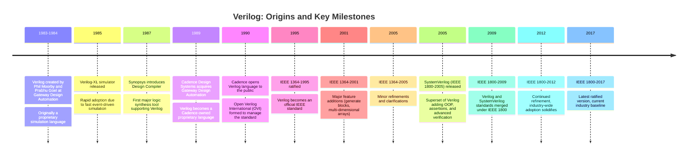
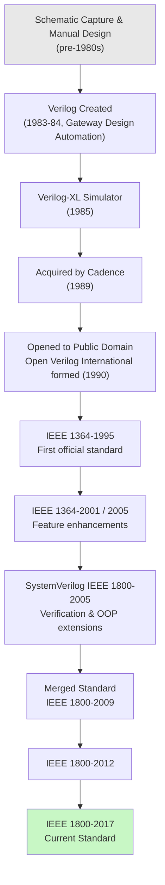
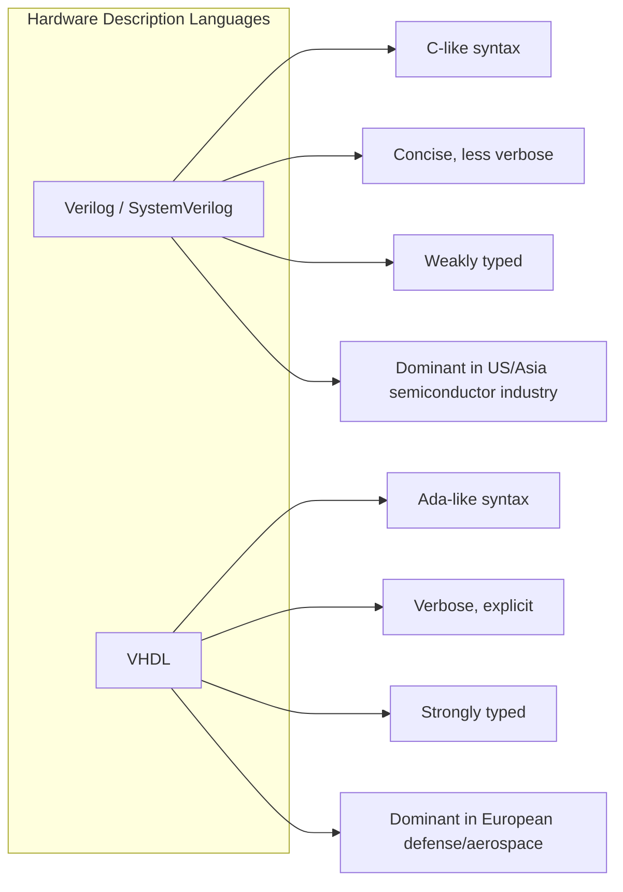
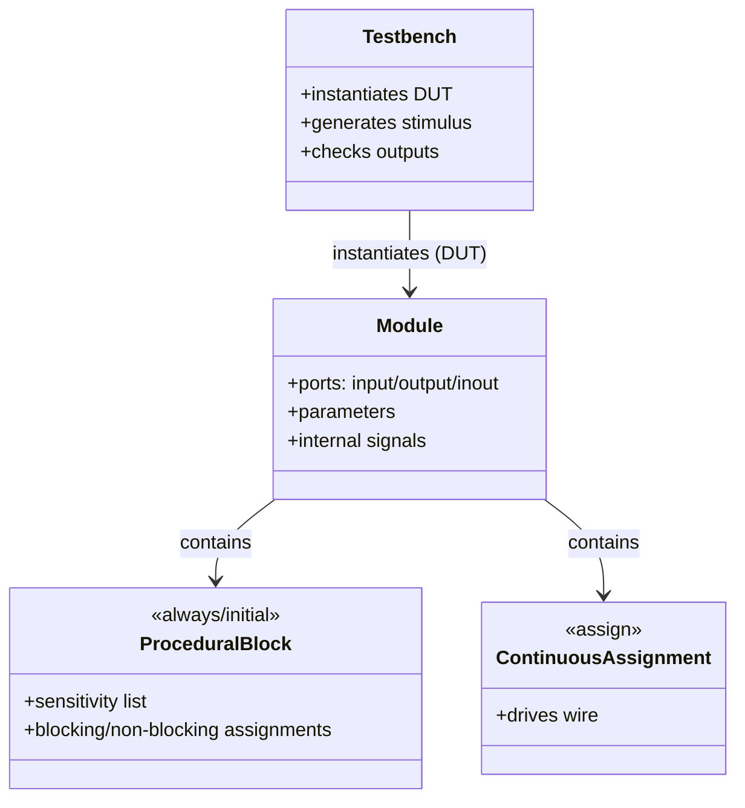
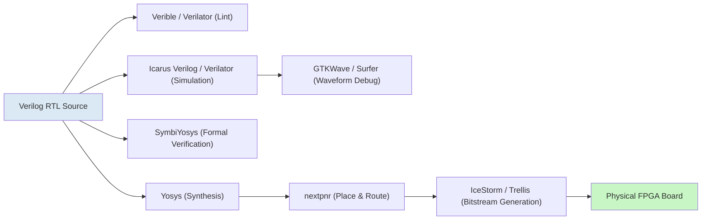

# A Complete Introduction to Verilog HDL

## Technical Overview: History, Evolution, Industry Standing, and Tooling

---

## 1. Introduction

Verilog is a **Hardware Description Language (HDL)** used to model, design, simulate, and verify digital electronic systems - from a simple logic gate to a multi-billion-transistor microprocessor. Unlike a software programming language such as C or Python, which describes a sequence of instructions executed over time on a processor, Verilog describes **hardware structure and behavior**, including circuits that operate **concurrently** (many things happening at the same instant, just as real hardware does).

Verilog is used across the entire chip design lifecycle:

- **RTL (Register Transfer Level) design** - describing how data moves between registers on each clock cycle
- **Gate-level modeling** - describing circuits as interconnected logic gates  
- **Testbenches** - writing code that stimulates a design and checks its responses
- **Synthesis** - translating RTL into a gate-level netlist that can be fabricated
- **Simulation and verification** - checking that a design behaves correctly before committing to silicon

Today, Verilog and its object-oriented superset, **SystemVerilog**, form the backbone of ASIC and FPGA design flows used by companies like Intel, AMD, NVIDIA, Qualcomm, and virtually every semiconductor company in the world.

---

## 2. Why Was a Hardware Description Language Needed?

Before HDLs existed, digital circuits were designed using:

1. **Schematic capture** - engineers manually drew gate-level and transistor-level schematics
2. **Breadboarding and manual layout** - physically wiring or laying out circuits
3. **Boolean algebra and Karnaugh maps** - for logic minimization, done largely by hand

This approach worked when circuits contained dozens or hundreds of gates. But as integrated circuits scaled from **Small-Scale Integration (SSI)** to **Very Large-Scale Integration (VLSI)** in the late 1970s and 1980s, chips began to contain **tens of thousands to millions of transistors**. Several critical problems emerged:

| Problem with Schematic-Based Design | Consequence |
|---|---|
| Manually drawing millions of gates | Physically infeasible, extremely slow |
| No way to simulate behavior before fabrication | Costly silicon re-spins to fix bugs |
| Difficult to reuse designs across projects | Low engineering productivity |
| No abstraction above the gate level | Impossible to manage growing complexity |
| Hard to verify correctness systematically | High risk of functional bugs reaching silicon |

The industry needed a way to:

- **Describe hardware textually**, the way software is written, so designs could be version-controlled, reused, and scaled
- **Simulate behavior in software** before spending months and millions of dollars fabricating physical silicon
- **Raise the abstraction level** from individual transistors/gates to functional blocks (adders, multiplexers, state machines) describable in a compact form
- **Automatically synthesize** gate-level circuits from a higher-level description, similar to how a compiler translates C into machine code

This need - simulate first, fabricate later, and describe hardware at a higher level of abstraction - is precisely what gave rise to Hardware Description Languages, with Verilog and VHDL becoming the two dominant ones.

---

## 3. History of Verilog



### 3.1 Origins

Verilog was created in **1983-1984** by **Phil Moorby and Prabhu Goel** at a company called **Gateway Design Automation**. It was initially conceived not as an open industry standard, but as a **proprietary hardware simulation language**, tightly coupled to Gateway's own simulator, **Verilog-XL**. The name "Verilog" itself is a blend of "Verification" and "Logic."

Verilog-XL became extremely popular in the mid-to-late 1980s because of its efficient **event-driven simulation** algorithm, which allowed engineers to simulate large digital designs in reasonable time - a major improvement over existing tools.

### 3.2 The Cadence Era and Standardization

In 1989, **Cadence Design Systems** acquired Gateway Design Automation, and with it, ownership of the Verilog language and simulator. Recognizing that competing hardware description language VHDL had the advantage of being an **open IEEE standard** (ratified in 1987), Cadence made a strategic decision in 1990 to **open Verilog to the public domain**. This led to the formation of **Open Verilog International (OVI)**, an industry body tasked with maintaining and evolving the language independent of Cadence.

This move was pivotal - it allowed the entire EDA (Electronic Design Automation) industry, not just Cadence, to build tools supporting Verilog, which accelerated adoption dramatically.

### 3.3 IEEE Standardization

- **1995**: Verilog became an official standard, **IEEE 1364-1995**, cementing it as vendor-neutral.
- **2001**: IEEE 1364-2001 added significant features such as `generate` blocks (for parameterized hardware generation), enhanced configuration mechanisms, and better support for large designs.
- **2005**: IEEE 1364-2005 made further refinements.

### 3.4 The Rise of SystemVerilog

By the early 2000s, verification of increasingly complex chips had become the dominant bottleneck in design cycles - often consuming 60-70% of total project time. Verilog's built-in verification constructs were limited. This led Accellera (an EDA standards organization) to develop **SystemVerilog**, ratified as **IEEE 1800-2005**, which extended Verilog with:

- Object-oriented programming (classes, inheritance)
- Constrained-random stimulus generation
- Functional coverage
- Assertions (SVA - SystemVerilog Assertions)
- Interfaces and improved type systems

In **2009**, the IEEE merged the Verilog (1364) and SystemVerilog (1800) standards into a single unified standard under **IEEE 1800**, effectively making SystemVerilog the official superset and successor. The most recent ratified version is **IEEE 1800-2017**, which remains the current industry baseline.

---

## 4. Evolution and Relationship Diagram



### 4.1 Verilog vs. VHDL (Conceptual Comparison)



### 4.2 Typical Digital Design Flow Using Verilog

```mermaid
flowchart LR
 Spec["Design Specification"] --> RTL["RTL Coding (Verilog/SystemVerilog)"]
 RTL --> TB["Testbench Development"]
 TB --> Sim["Functional Simulation"]
 Sim -->|Bugs Found| RTL
 Sim -->|Verified| Lint["Linting & Static Checks"]
 Lint --> Synth["Logic Synthesis"]
 Synth --> Gate["Gate-Level Netlist"]
 Gate --> GateSim["Gate-Level Simulation"]
 GateSim --> PnR["Place & Route (ASIC) / Bitstream Gen (FPGA)"]
 PnR --> STA["Static Timing Analysis"]
 STA --> Tapeout["Tapeout (ASIC) / Programming (FPGA)"]

 style Spec fill:#dbe9f4
 style Tapeout fill:#f4d6d6
```



---

## 5. Core Language Concepts (Brief Technical Primer)

Verilog models hardware using several key constructs:

- **Modules** - the fundamental unit of design, analogous to a function or class, representing a piece of hardware with defined inputs/outputs (ports)
- **Data types** - `wire` (represents physical connections/nets) and `reg`/`logic` (represents storage elements or combinational results)
- A Verilog reg doesn't inherently mean a hardware register. It is a procedural variable.
- **Procedural blocks** - `always` blocks (for sequential/combinational logic) and `initial` blocks (typically for simulation/testbenches)
- **Concurrency** - statements inside separate `always` blocks execute in parallel, modeling real hardware behavior, unlike sequential software execution
- **Blocking (`=`) vs. non-blocking (`<=`) assignments** - used to correctly model combinational vs. clocked sequential logic
- **Continuous assignments (`assign`)** - used to model combinational logic driving `wire` types
- **Parameters and generate blocks** - allow parameterized, reusable, and scalable hardware descriptions
- **Tasks and functions** - reusable code blocks, similar to subroutines



---

## 6. Current Industry Standpoint

Verilog/SystemVerilog remains **firmly entrenched** as one of the two dominant HDLs in the semiconductor industry (alongside VHDL), but its role and the surrounding ecosystem have evolved substantially.

### 6.1 Where Verilog/SystemVerilog Stands Today

- **RTL design**: Synthesizable Verilog/SystemVerilog is the primary language for describing digital logic in the vast majority of ASIC and FPGA projects worldwide, especially in the US and Asia-Pacific semiconductor ecosystems (VHDL retains stronger footing in European aerospace/defense and some industrial sectors).
- **Verification**: SystemVerilog, combined with the **UVM (Universal Verification Methodology)** - a standardized class library and methodology built on SystemVerilog's OOP features - is the de facto industry standard for functional verification of complex ASICs.
- **FPGA design**: Both major FPGA vendors, AMD (Xilinx) and Intel (Altera), fully support Verilog/SystemVerilog in their toolchains (Vivado, Quartus) alongside VHDL.
- **Mixed-language flows**: Large organizations frequently mix Verilog, SystemVerilog, and VHDL within the same project using mixed-language simulation and synthesis support in commercial tools.

### 6.2 Emerging Trends Affecting Verilog's Ecosystem

- **High-Level Synthesis (HLS)**: Tools that generate RTL from C++/SystemC are used for certain algorithm-heavy blocks (e.g., DSP, some ML accelerators), but Verilog/SystemVerilog RTL remains the "gold standard" sign-off representation.
- **Chisel and other HDL generators**: Languages like **Chisel** (Scala-based, used prominently in RISC-V projects like those from Berkeley and SiFive) and hardware construction frameworks generate Verilog as their output, rather than replacing it - Verilog remains the common interchange format that downstream synthesis and simulation tools consume.
- **Open-source EDA movement**: A significant open-source hardware tooling ecosystem (discussed below) has emerged, particularly driven by the RISC-V open instruction set movement, academic research, and the maker/FPGA hobbyist community.
- **AI-assisted RTL design**: There is growing exploration of using large language models to assist with generating, debugging, and documenting Verilog/SystemVerilog code, and several EDA vendors have begun integrating generative AI features into their design suites.
- **Formal verification growth**: Increasing reliance on formal property verification (using SystemVerilog Assertions) to complement traditional simulation-based verification, especially as design complexity increases.

### 6.3 Industry Landscape Snapshot

```mermaid
mindmap
 root((Verilog / SystemVerilog<br/>Industry Role))
 RTL Design
 ASIC design houses
 FPGA vendors (AMD, Intel)
 SoC development
 Verification
 UVM methodology
 Constrained-random testing
 Formal verification / SVA
 Ecosystem Pressure
 Chisel / HLS as generators
 Open-source EDA tools
 RISC-V driven adoption
 AI-assisted RTL generation
 Commercial Tooling
 Synopsys VCS / Design Compiler
 Cadence Xcelium / Genus
 Siemens (Mentor) Questa
```

---

## 7. Free and Open-Source Tools for Verilog

While commercial EDA tools (Synopsys, Cadence, Siemens EDA) dominate production chip design due to their maturity, performance, and vendor support, a robust open-source ecosystem has emerged - driven heavily by academia, the RISC-V movement, and hobbyist FPGA communities.

### 7.1 Simulation Tools

| Tool | Description |
|---|---|
| **Icarus Verilog (iverilog)** | One of the most widely used open-source Verilog simulators/compilers; supports most of Verilog-2005 and portions of SystemVerilog. Great for learning and small-to-medium projects. |
| **Verilator** | Extremely fast open-source Verilog/SystemVerilog simulator that compiles designs into optimized C++/SystemC models rather than interpreting them; widely used in industry and open-source chip projects (e.g., for RISC-V core verification) for its speed. |
| **cocotb** | A Python-based verification framework that works alongside simulators like Icarus Verilog and Verilator, allowing testbenches to be written in Python instead of Verilog/SystemVerilog. |

### 7.2 Synthesis Tools

| Tool | Description |
|---|---|
| **Yosys** | The leading open-source framework for Verilog RTL synthesis; converts Verilog into gate-level netlists and supports numerous back-end flows for both ASIC and FPGA targets. |
| **Yosys + SymbiFlow / F4PGA** | An open-source toolchain built on Yosys for synthesizing designs targeting real commercial FPGAs (e.g., certain Xilinx 7-series and Lattice iCE40/ECP5 parts). |

### 7.3 Place & Route / FPGA Backend Tools

| Tool | Description |
|---|---|
| **nextpnr** | Open-source, portable place-and-route tool commonly paired with Yosys, supporting Lattice iCE40, ECP5, and some Xilinx/Gowin devices. |
| **Project IceStorm** | Fully open-source toolchain (bitstream documentation + tools) for Lattice iCE40 FPGAs - a landmark project that reverse-engineered a commercial FPGA bitstream format. |
| **Project Trellis** | Similar open-source bitstream documentation/toolchain effort for Lattice ECP5 FPGAs. |

### 7.4 Waveform Viewers & Debug

| Tool | Description |
|---|---|
| **GTKWave** | The standard open-source waveform viewer for inspecting simulation output (VCD/FST files) from simulators like Icarus Verilog and Verilator. |
| **Surfer** | A newer, actively developed open-source waveform viewer with a modern interface, increasingly popular as an alternative to GTKWave. |

### 7.5 Linting and Formal Verification

| Tool | Description |
|---|---|
| **Verilator (lint mode)** | Also widely used purely as a fast, strict Verilog/SystemVerilog linter, even when not used for simulation. |
| **SymbiYosys (SBY)** | Open-source formal verification front-end built on Yosys, used for property checking (assertions), equivalence checking, and bounded model checking. |
| **Verible** | Google's open-source SystemVerilog toolkit including a style linter, formatter, and parser/indexer - useful for enforcing coding standards and IDE integration. |

### 7.6 Free (but Not Fully Open-Source) Vendor Tools

| Tool | Description |
|---|---|
| **Xilinx (AMD) Vivado WebPACK** | Free edition of Vivado supporting a range of smaller/mid-range Xilinx FPGAs; proprietary but no-cost. |
| **Intel Quartus Prime Lite Edition** | Free edition of Intel's FPGA design suite for a subset of Intel/Altera FPGA families. |
| **EDA Playground** | A free browser-based platform to write and simulate Verilog/SystemVerilog online using various simulator backends (including free/open ones), extremely popular for learning and quick prototyping without any local installation. |

### 7.7 Representative Open-Source Toolchain Flow



---

## 8. Summary

Verilog emerged in 1983-84 as a proprietary simulation language and, through strategic open standardization by Cadence and subsequent IEEE ratification, became one of the two pillars of modern digital design alongside VHDL. Its evolution into SystemVerilog addressed the industry's growing verification burden by adding object-oriented and assertion-based capabilities, and the unification of both standards under IEEE 1800 in 2009 created the language ecosystem used today.

Despite the emergence of higher-level hardware construction languages (like Chisel) and high-level synthesis flows, Verilog/SystemVerilog remains the **universal sign-off representation** for digital hardware - the common language that virtually every synthesis, simulation, and verification tool ultimately consumes. Meanwhile, a maturing open-source EDA ecosystem (Yosys, Verilator, nextpnr, and related projects) - substantially propelled by the RISC-V open hardware movement - has made it increasingly practical to design, simulate, and even fabricate real hardware using entirely free and open-source tools, a capability that did not meaningfully exist a decade ago.

---

*This document is prepared as a technical primer on Verilog HDL - covering history, motivation, evolution, industry positioning, and tooling ecosystem.*
